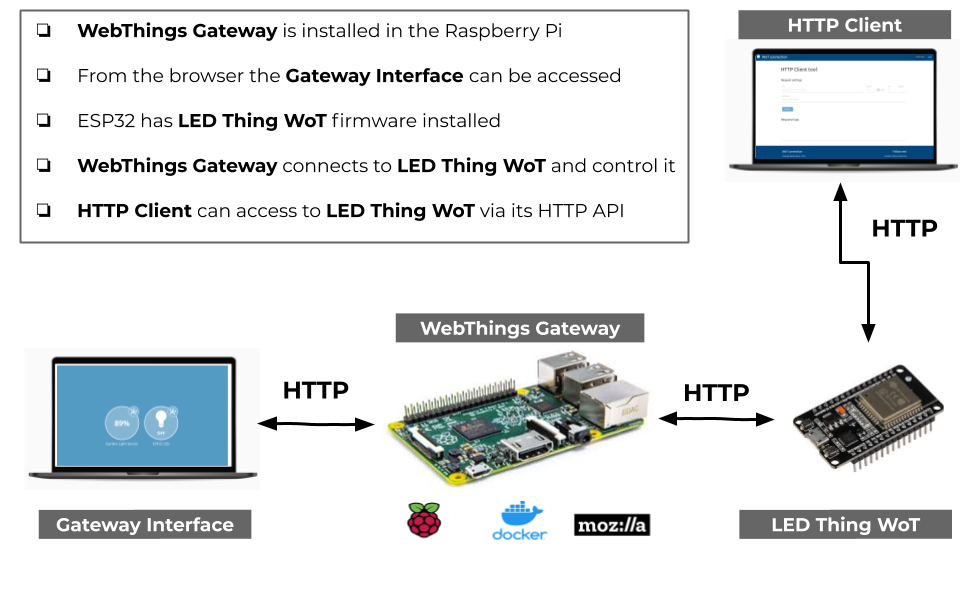
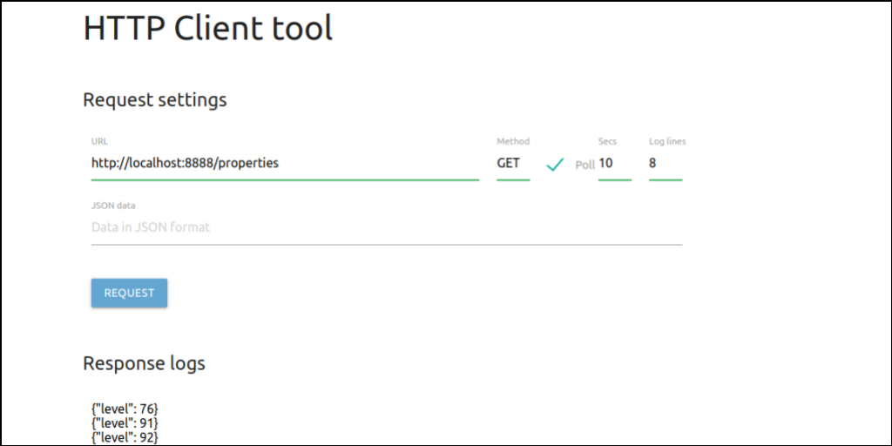

# Open source MQTT Platform

Author: Agustin Bassi - 2020

## 
## Table of Contents


* [Context](#context)
* [Platform Introduction](#platform-introduction)
* [Install dependencies](#install-dependencies)
* [Run the application](#run-the-application)
* [Run LED Thing WoT (optional)](#run-led-thing-wot-(optional))
* [Want to help?](#want-to-help-?)
* [License](#license)

## 
## Context

Web of Things (WoT) describes a set of standards by the W3C for solving the interoperability issues of different Internet of Things (IoT) platforms and application domains.

A Thing Description describes a virtual or physical device (Thing). It can be considered to be the entry point for a Thing. Like the index.html page of a WWW website. It describes all available actions, events and properties of a Thing. As well as all available security mechanisms to access them. The Thing Description in highly flexible in order to guarantee interoperability. Additionally to the standard functionality, it describes, with TD Context Extension, a mechanism to extend the functionality. A Thing Description also contains meta data about a Thing, such as titles and descriptions for the actions, events and properties.

Mozilla WebThings is an implementation of WoT protocol which is based in a WebThings Gateway (can be a dedicated RPi image or Docker container) and an WebThings API to communicates with Gateway in many languages.

## 
## Platform Description

The goal of this project is to create an open source Web of Things (WoT) Platform to be used as a part of an IoT system, based on WoT protocol.

The platform consists in several modules described below (All of them are well described in the [Project Wiki](https://github.com/agustinBassi/wot-connection/wiki)).

* **Mozilla WebThings Gateway**: Raspberry Pi that runs a Docker container running Mozillla WebThings gateway. From this service the devices can be controlled.
* **LED Thing WoT**: A Web of Things firmware for ESP32 which acts as a LED Thing WoT and can be controlled via the Gateway.
* **HTTP Client**: A Single Page Application (SPA) that communicates with Things via HTTP and can control them via HTTP Requests and get information.
* **WoT Thing Python**: A dockerized Python application which acts as a fake Light Sensor Thing and sends to the Gateway random measures of light percentaje each 10 seconds.

In the figure below there is a description of the platform modules and how they interact each others.



_In the architecture, `WoT Thing Python` is not described because it is a software implementation running in a Docker container into Raspberry Pi, in the same place as WebThings Gateway._

## 
## Install dependencies


The application runs over Raspberry Pi 3+. To install Raspberry Pi OS refer to [official documentation](https://www.raspberrypi.org/documentation/installation/installing-images/).

The platform needs the next dependencies.

* Docker & Docker-Compose (installation steps in [this link](https://devdojo.com/bobbyiliev/how-to-install-docker-and-docker-compose-on-raspberry-pi)).

_Although the application is designed to run on a Raspberry Pi 3+, it can runs on any system with Docker & Docker Compose installed. Docker installation steps in [official documentation](https://docs.docker.com/get-docker/). Docker-Compose installation steps in [official documentation](https://docs.docker.com/compose/install/)._

## 
## Run the application

Once dependencies are installed in the Raspberry Pi do the next steps.

### 1.Download the platform code (this repository)

To download the platform code execute the next command.

```
git clone https://github.com/agustinBassi/wot-connection.git
cd wot-connection/
```

### 2.Start the WebThings Gateway, WoT Thing Python and HTTP server.

The next command will download all images, will compile `WoT Thing Python` and will start all services. 

```
docker-compose up
```

### 3.Access to WebThings Gateway Interface

Once services are running, go to [http://localhost:8080/](http://localhost:8080/) in the web browser, to see the interface.

Create an user and password, and go to `Settings->Add-Ons` click on `+` and install `Web Thing` Add-On.

Then go to home screen and click on `+` to add `WoT Thing Python` (it will be named as Light Sensor Fake). In case the gateway doesn't find the Thing, add it by URL putting its address: http://localhost:8888/. In the home page the sensor will be shown and this value will change periodically.

### 4.Access to WoT Thing Python from HTTP Client

To test all things, the last step is to connect to WoT Thing Python from HTTP Client and access to its API from the browser, in order to demonstrate that Web of Things is just an API Description with many features, but at the end, it is a REST API.

Open the HTTP Client going to [http://localhost:5001/](http://localhost:5001/) in the web browser. To get data from `WoT Thing Python` configure settings as shown in the next figure.



With this steps the main core feature are tested. 


## 
## Run LED Thing WoT (optional)

To run the `wot-thing-esp32` it is necessary to have installed [PlatformIO](https://platformio.org/) in order to compile the project and upload the code into the board. In [this link](https://iot-es.herokuapp.com/post/details/17) there is a guide to install PlatformIO for Visual Studio Code, compile and run a project. More details in the [Project Wiki](https://github.com/agustinBassi/wot-connection/wiki).

Once PlatformIO is installed, set WiFi access in the file `wot-thing-esp32/src/main.cpp` as follow (lines 27-28).

```c
// Wifi settings
const String WIFI_SSID   = "USER_WIFI_SSID";
const String WIFI_PASS   = "USER_WIFI_PASSWORD";
```

Then, plug the embedded device via USB and run the command below to compile and upload the code into the board (Change `platformio` for `pio` if command fails).

```sh
platformio run --target upload
```

Finally, open a serial terminal with settings 115200-N-8 in the correct port to see `wot-thing-esp32` running.

To add it to the gateway execute the same steps done while adding `WoT Thing Python` in the previous step 3. To know the IP address of ESP32 just open the serial terminal and copy the path shown there. 

## 
## Want to help?

Pull requests are welcome. For major changes, please open an issue first to discuss what you would like to change.

If someone want to helpme, every bit of effort will be appreciated. In [this link](https://github.com/agustinBassi/wot-connection/projects/1) there is the project status board. You can take any card you want (or propose one) from the ToDo list and start to work.

If you find it useful please helpme following my Github user and give to this project a Star. This will animate me to continue contribuiting with the great open source community.

## 
## License

This project is licensed under the GPLV3 License.

